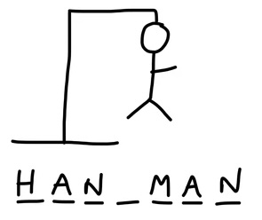

# 🧠 Hangman-RL: Teaching an Agent to Play Hangman with Proximal Policy Optimization

This project explores the application of **Reinforcement Learning** to the classic game **Hangman**. The agent learns to guess letters in a word through interactions with a custom-built environment, receiving feedback (rewards or penalties) based on its guesses. The learning is driven by a **Proximal Policy Optimization (PPO)** algorithm implemented from scratch using **TensorFlow**.

  

---

## 🧩 Key Features

- ✅ **Custom Hangman Environment**: Simulates the classic word-guessing game, complete with letter masks, incorrect guesses (lives), and win/loss conditions.
- 🧠 **PPO Algorithm**: The agent uses a policy network (actor) and a value network (critic) to iteratively improve its performance based on TD(0) targets and clipped objective functions.
- 🏃 **Parallelized Training**: 1024 parallel environments are used per epoch to decorrelate experience and accelerate learning.
- 📄 **Word Dataset**: A plain `.txt` file serves as the word dictionary, supporting realistic and varied vocabulary.
- 📈 **Baseline Comparison**: Includes a random agent for benchmarking learning progress.
- 📊 **Training Visualization**: A simple plot compares PPO performance with the random policy baseline.

---

## 🛠️ Files

- `hangman.py`: Contains the `Environment` and `Agent` classes, as well as PPO implementation.
- `hangman.ipynb`: Jupyter notebook to train the agent, track performance, and compare with random baseline.
- `dataset.txt`: List of words used as targets during gameplay.

---

This project is ideal for those who want to learn how **policy gradient methods like PPO** can be applied to environments beyond traditional benchmarks, and how to **implement RL algorithms from scratch** using TensorFlow.
